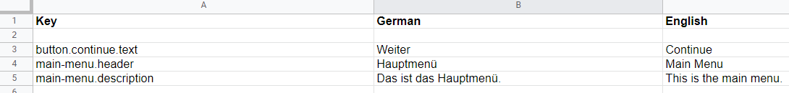
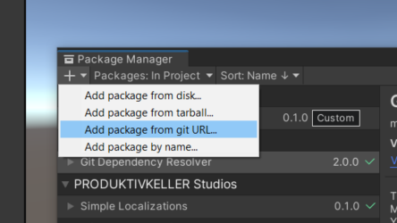
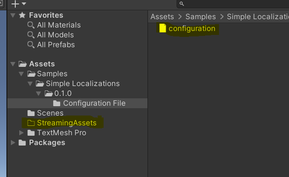

# Simple Localization
**Simple Localization** is a light-weight tool to add localization to your unity projects and manage it in an excel sheet. It is completely free to use.

## One Datasheet for all languages

**Simple Localization** allows you to do localization in a single document, that is very straightforward to use.



It contains one column for the localization-keys and one column for every language in the project.

## Getting Started

### Installation

First install the [Git Dependency Resolver For Unity]("https://github.com/mob-sakai/GitDependencyResolverForUnity") by adding the following lines to your `manifest.json`:


```json
{
  "dependencies": {
    "com.coffee.git-dependency-resolver": "https://github.com/mob-sakai/GitDependencyResolverForUnity.git"
  }
}
```

*Other ways to install the [Git Dependency Resolver For Unity]("https://github.com/mob-sakai/GitDependencyResolverForUnity") can be found on their GitHub page.*

Then install **Simple Localization** by adding the following lines to your `manifest.json`:

```json
{
  "dependencies": {
    "com.produktivkeller.simple-audio-solution": "https://github.com/PRODUKTIVKELLER/simple-localization.git"
  }
}
```

Alternatively you can also import the package from the GIT Url with the **package manager**:




### Set-Up

1. Copy and paste the example prefab `Packages/com.produktivkeller.simple-audio-solution/Prefabs/LocalizationService` to your `Assets` folder. Otherwise, your changes to the prefab will be overriden by updates of **Simple Localization**.

2. Make sure you have an excel document that contains your localization in the right format (the name of the sheet has to be "Localization" and it must contain the columns shown in the image above). If you want an easy template to work with, you can import it from the "Samples" section of this package in the package manager and move it to the folder `Assets/StreamingAssets`.




3. Drag and drop the prefab from step one to your scene.

4. That's it!

## Documentation

### Localize a text

Any Gameobject that has a TextMeshPro text component can be localized by adding the "LocalizedText" Script as a component.


The key that you enter here has to match the localized key in the configuration.xlsx file.

You can also localize text by accessing a function on LocalizationService.Instance like this:

```csharp
TextMeshProUGUI _text = GetComponent<TextMeshProUGUI>();
string localizationKey = "my.awesome.key"

_text.text = LocalizationService.Instance.ResolveLocalizationKey(localizationKey);
```

### Change the language

If you want to change the language you can call a function on LocalizationService.Instance:

```csharp
Language language = Language.EN

LocalizationService.Instance.ChangeLanguage(language);
```

### Adding more languages

Currently the only two supported languages are German and English, if you want to manually add more languages that is entirely possible. 
You would have to extend your configuration.xlsx by another column and make minor changes to the code of the following files:

`Excel/LocalizationParser.cs`
`Unity/Language.cs`
`Unity/LocalizationService.cs`

If you need assistance with adapting those files to your needs, feel free to reach out to us (see **Contributing** for contact data).

Also there is likely going to be an update in the future that will add more supported languages to the tool natively.

## References

**Simple Localization** is used in [Pin Them](https://store.steampowered.com/app/1764220/Pin_Them). It is developed by [PRODUKTIVKELLER Studios](https://produktivkeller.com/).

## Contributing

As an open-source project we would love to see you contributing to the project. If you have feature requests or want to contribute, feel free to reach out to us via **GitHub**, join our [Discord](https://discord.gg/KMurg8H823) or write us an email at `info.produktivkeller@gmail.com`.